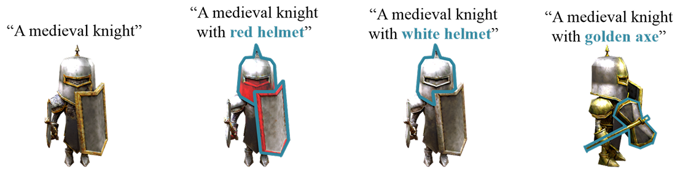
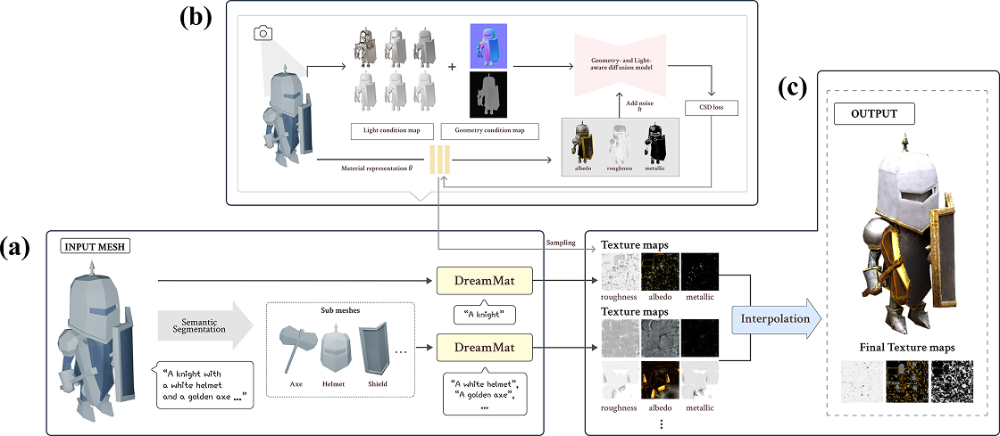
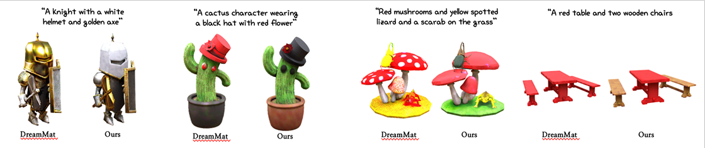

# MatGenAI
We propose MatGenAI, a multi-pipeline DreamMat framework that integrates 3D mesh semantic segmentation with a Large Language Model. DreamMat uses a single text prompt to generate materials for an entire 3D model, limiting its ability to accurately map local features—like a 'golden axe'—to their corresponding parts. Our approach resolves this mismatch between semantic descriptions and local features.

### Limitation of dreammat


## Method
### Proposed pipeline


### (a) Extended pipeline
1. The input 3D mesh is segmented into sub-meshes based on semantic units.
2. The semantic information of each sub-mesh is extracted in textual form using an LLM.
3. It is extended into a sub-pipeline conditioned on (sub-mesh, semantic description).

### (b) Training step
1. Each pipeline independently predicts PBR materials by following the material prediction methodology of DreamMat.
2. Each PBR material — Albedo, Metallic, and Roughness — is defined according to the hash-grid function.

### (c) Texture export
1. Each sub-mesh is normalized to a global coordinate system centered at the origin (0,0,0) by an affine transformation matrix.
2. Therefore, a coordinate transformation process is performed to apply the generated sub-textures back to the original mesh.

## Conclusion
The point of our research is to segment a 3D mesh into semantic units and automatically generate optimized text prompts for each part using a Large Language Model. This allows each pipeline to independently infer PBR materials based on prompts optimized for local features, resulting in textures that more accurately reflect semantic information. Furthermore, this methodology requires no additional training or fine-tuning, making it a practical solution for use in environments with limited GPU resources.

### results


# How to use
You must follow the Installation Guide on each project's GitHub page.
1. Install DreamMat for inference PBR Material
[DreamMat](https://zzzyuqing.github.io/dreammat.github.io/)

2. Prepare SAMPart3D for semantic segmentation
[SAMPart3D](https://github.com/Pointcept/SAMPart3D)

3. To input your 3D mesh file (ex, knight.obj) into SAMPart3D and get a .npy file containing the per-part segmentation information as output.

4. Instead of the knight example, use your own filenames and place them according to the structure below.
```
threestudio_dreammat/load
|-- shapes
    |-- objs
        |-- knight.obj
    |-- seg
        |-- knight.npy
```

5. Run MatGenAI.
```
cd MatGenAI/MatGenAI/threestudio_dreammat
sh cmd/run_examples.sh
```

# Acknowledgement
Our work heavily builds upon the following research. We are grateful to the original researchers for their contribution.

* Zhang, Y., Liu, Y., et al. (2024). DreamMat: High-quality pbr material generation with geometry-
and light-aware diffusion models. ACM Transactions on Graphics (TOG), 43(4), 1-18.
[[Project Page]](https://zzzyuqing.github.io/dreammat.github.io/)

* Yang, Y., Huang, Y., et al. (2024). SAMPart3D: Segment any part in 3d objects. arXiv preprint
arXiv:2411.07184.
[[Project Page]](https://github.com/Pointcept/SAMPart3D)
